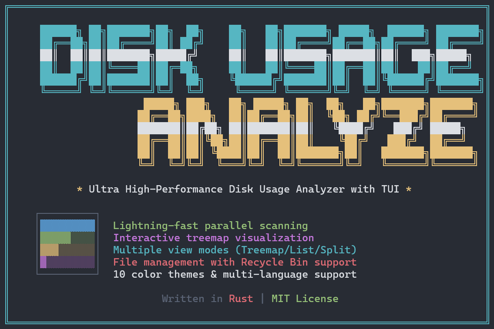
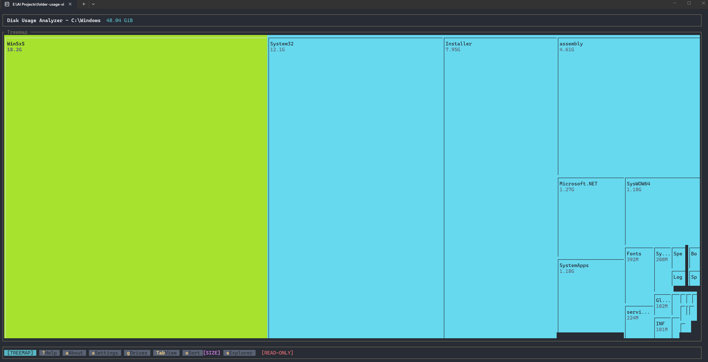
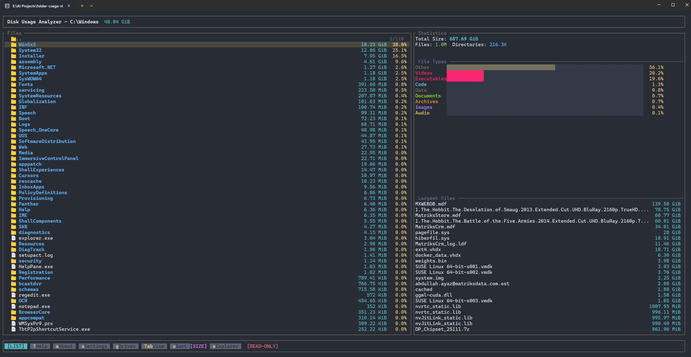
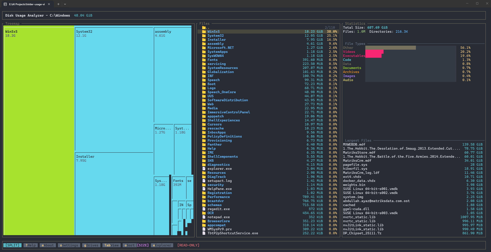
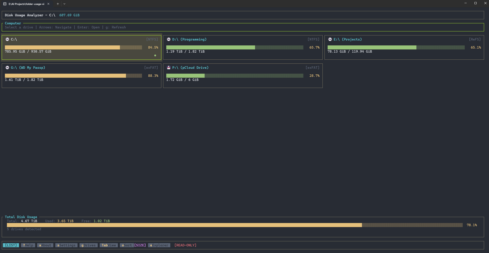
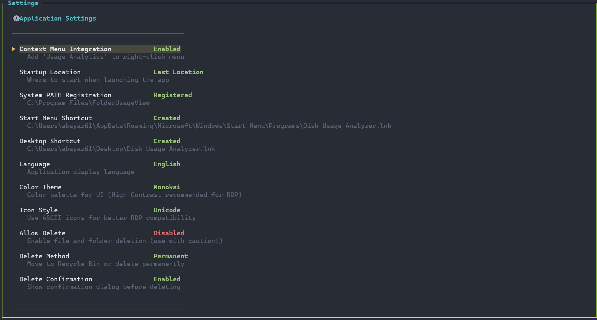

# Disk Usage Analyzer (DUA)

<p align="center">
  
</p>

<p align="center">
  <strong>Ultra high-performance disk usage analyzer with TUI and treemap visualization</strong>
</p>

<p align="center">
  <a href="#features">Features</a> •
  <a href="#screenshots">Screenshots</a> •
  <a href="#installation">Installation</a> •
  <a href="#usage">Usage</a> •
  <a href="#keyboard-shortcuts">Shortcuts</a> •
  <a href="#settings">Settings</a> •
  <a href="#building">Building</a>
</p>

---

## Features

- **Lightning-Fast Scanning** - Parallel filesystem traversal using all CPU cores
- **Interactive Treemap** - Visual representation of disk usage with color-coded file types
- **Multiple View Modes** - Treemap, List, and Split views
- **Real-time Statistics** - Live scanning progress with speed metrics
- **File Management** - Delete files/folders with Recycle Bin support
- **Drive Navigation** - Browse all drives from Computer View
- **Windows Integration** - Context menu, Start Menu, and Desktop shortcuts
- **Multi-language Support** - English and Turkish
- **10 Color Themes** - Including high contrast themes for RDP
- **Portable** - Single executable, no installation required

## Screenshots

### Treemap View
<p align="center">
  
</p>

*Interactive treemap visualization showing disk usage distribution*

### List View
<p align="center">
  
</p>

*Detailed file list with size and percentage information*

### Split View
<p align="center">
  
</p>

*Combined treemap and list view for comprehensive analysis*

### Computer View
<p align="center">
  
</p>

*Overview of all drives with usage statistics*

### Settings
<p align="center">
  
</p>

*Customizable settings including Windows integration options*

## Installation

### Pre-built Binary

Download the latest release from [Releases](https://github.com/abayaz61/folder-usage-view/releases) page.

### Using Cargo

```bash
cargo install --git https://github.com/abayaz61/folder-usage-view.git
```

### Build from Source

```bash
git clone https://github.com/abayaz61/folder-usage-view.git
cd folder-usage-view
cargo build --release
```

The binary will be at `target/release/dua.exe`

### Register Console Command

To use `dua` command from any terminal:

1. Run the application
2. Press `s` to open Settings
3. Enable **"Console Command (dua)"** (requires Administrator)
4. Restart your terminal

Now you can run `dua` from any folder!

## Usage

### Basic Usage

```bash
# Analyze current directory
dua

# Analyze specific path
dua --path "C:\Users"

# Enable delete functionality
dua --allow-delete

# Show hidden files
dua --show-hidden
```

### Command Line Options

| Option | Description |
|--------|-------------|
| `-p, --path <PATH>` | Path to analyze (default: current directory) |
| `--allow-delete` | Enable file/folder deletion |
| `--follow-symlinks` | Follow symbolic links |
| `--show-hidden` | Show hidden files and directories |
| `-h, --help` | Print help information |
| `-V, --version` | Print version |

## Keyboard Shortcuts

### Navigation

| Key | Action |
|-----|--------|
| `↑` `k` | Move up |
| `↓` `j` | Move down |
| `→` `l` | Enter directory |
| `Enter` | Enter directory / Open file |
| `Backspace` `←` | Go back / Parent directory |
| `Page Up` | Move up 10 items |
| `Page Down` | Move down 10 items |
| `Home` | Go to first item |
| `End` | Go to last item |

### Views

| Key | Action |
|-----|--------|
| `Tab` | Cycle view mode (Treemap → List → Split) |
| `o` | Cycle sort mode (Size → Name → Type → Date) |

### Selection (Multi-Select)

| Key | Action |
|-----|--------|
| `Space` | Toggle selection on current item |
| `Shift` + `↑` | Move up and toggle selection |
| `Shift` + `↓` | Move down and toggle selection |
| `Shift` + `Page Up` | Select/deselect 10 items up |
| `Shift` + `Page Down` | Select/deselect 10 items down |

> **Note:** Multi-select works as toggle - moving over an already selected item will deselect it. Selections are cleared when navigating to a different folder.

### Actions

| Key | Action |
|-----|--------|
| `Enter` | Open file with default application |
| `e` | Open current folder in Explorer |
| `d` | Delete selected items (shows confirmation) |
| `Delete` | Delete current item directly |
| `g` | Open drive selector / Refresh drives |

### Other

| Key | Action |
|-----|--------|
| `?` `h` | Toggle help |
| `a` | About |
| `s` | Settings |
| `q` `Esc` | Quit |

### Mouse

- **Click** - Select item
- **Click on selected item** - Open file/folder
- **Double-click** - Enter directory
- **Right-click** - Toggle selection
- **Scroll** - Navigate list

## Settings

Access settings by pressing `s`. All settings are saved automatically.

### General Settings

| Setting | Description |
|---------|-------------|
| **Context Menu** | Add "Usage Analytics" to Windows right-click menu |
| **Startup Location** | Where to start (Last Location / Current Folder / Computer View) |
| **Console Command (dua)** | Register `dua` command to run from any terminal |
| **Start Menu Shortcut** | Create shortcut in Windows Start Menu |
| **Desktop Shortcut** | Create shortcut on Desktop |

### Appearance

| Setting | Description |
|---------|-------------|
| **Language** | English / Türkçe |
| **Color Theme** | 10 themes including High Contrast for RDP |
| **Icon Style** | Unicode (default) / ASCII (better RDP compatibility) |

### Delete Settings

| Setting | Description |
|---------|-------------|
| **Allow Delete** | Enable/disable delete functionality |
| **Delete Method** | Recycle Bin / Permanent |
| **Delete Confirmation** | Show confirmation dialog before deleting |

## Color Themes

| Theme | Description |
|-------|-------------|
| Default | Balanced colors for most terminals |
| High Contrast | Maximum readability, great for RDP |
| Dark | Dark theme with muted colors |
| Light | Light theme for bright environments |
| Ocean | Blue-green oceanic tones |
| Forest | Green nature-inspired palette |
| Sunset | Warm orange and red tones |
| Monochrome | Grayscale for maximum compatibility |
| Neon | Vibrant cyberpunk colors |
| Pastel | Soft, easy-on-the-eyes colors |

## File Type Colors

Files are color-coded by type in the treemap:

| Color | File Types |
|-------|------------|
| Blue | Documents (pdf, doc, txt, etc.) |
| Green | Images (jpg, png, gif, etc.) |
| Yellow | Videos (mp4, avi, mkv, etc.) |
| Cyan | Audio (mp3, wav, flac, etc.) |
| Magenta | Archives (zip, rar, 7z, etc.) |
| Red | Executables (exe, dll, etc.) |
| White | Code files (js, py, rs, etc.) |
| Gray | Other files |

## Performance

Disk Usage Analyzer is optimized for speed:

- **Parallel scanning** using all available CPU cores
- **Efficient memory usage** with arena allocation
- **Incremental UI updates** during scanning
- **LTO and optimizations** in release builds

Typical performance on modern hardware:
- ~100,000 files/second scanning speed
- ~1 million files in under 10 seconds
- Minimal memory footprint

## Building

### Requirements

- Rust 1.70 or later
- Windows 10/11 (for Windows-specific features)

### Build Commands

```bash
# Debug build
cargo build

# Release build (optimized)
cargo build --release

# Run directly
cargo run --release -- --path "C:\"
```

### Build Features

The release build includes:
- LTO (Link-Time Optimization)
- Single codegen unit
- Maximum optimization level
- Stripped binary

## Project Structure

```
folder-usage-view/
├── src/
│   ├── main.rs           # Entry point
│   ├── lib.rs            # Library exports
│   ├── app/              # Application state and config
│   │   ├── config.rs     # Configuration
│   │   ├── settings.rs   # Persistent settings
│   │   └── state.rs      # App state management
│   ├── model/            # Data structures
│   │   ├── node.rs       # File tree nodes
│   │   ├── tree.rs       # File tree
│   │   └── drives.rs     # Drive information
│   ├── scanner/          # Filesystem scanning
│   │   ├── parallel.rs   # Parallel scanner
│   │   └── entry.rs      # Scan entries
│   ├── treemap/          # Treemap algorithm
│   │   ├── layout.rs     # Squarified layout
│   │   └── rect.rs       # Rectangle utilities
│   ├── ui/               # User interface
│   │   ├── event_loop.rs # Event handling
│   │   ├── theme.rs      # Color themes
│   │   └── widgets/      # UI components
│   └── util/             # Utilities
│       ├── format.rs     # Size formatting
│       └── i18n.rs       # Internationalization
├── Cargo.toml
└── README.md
```

## Contributing

Contributions are welcome! Please feel free to submit a Pull Request.

## License

This project is licensed under the MIT License - see the [LICENSE](LICENSE) file for details.

## Acknowledgments

- [ratatui](https://github.com/ratatui-org/ratatui) - Terminal UI framework
- [jwalk](https://github.com/jessegrosjean/jwalk) - Parallel filesystem walking
- [crossterm](https://github.com/crossterm-rs/crossterm) - Cross-platform terminal manipulation

---

<p align="center">
  Made with ❤️ in Rust
</p>
